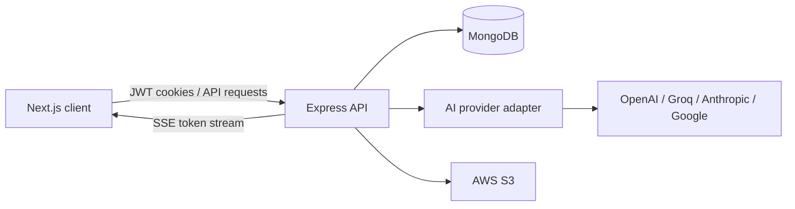

# DocuMind

AI document assistant with multi-provider LLM chat, persistent conversations, file uploads, and a TypeScript full-stack architecture.

## Overview

DocuMind is a full-stack application for asking focused questions about technical documentation with an AI assistant. Users can authenticate, choose a documentation source, start conversations, attach supported media, and continue from saved conversation history. The web client and API server are separated into independently runnable Next.js and Express applications.

## Features

- Email/password and Google-backed authentication with JWT access and refresh tokens.
- Documentation-focused chat with selectable documentation contexts.
- Streaming assistant responses over server-sent events.
- Persistent conversations and messages stored in MongoDB.
- Image, audio, video, and document uploads with MIME-type and 25 MB validation.
- AWS S3-backed media storage with public URL generation.
- Conversation history, message feedback controls, and scheduled items in the authenticated app.

## Tech Stack

- **Frontend:** Next.js, React, TypeScript, Tailwind CSS, TanStack Query, Redux Toolkit.
- **Backend:** Node.js, Express, TypeScript.
- **Data:** MongoDB and Mongoose.
- **AI:** Vercel AI SDK with OpenAI, Groq, Anthropic, and Google provider integrations.
- **Storage:** AWS S3.
- **Authentication:** JWT, HTTP-only cookies, bcrypt, and Google OAuth token verification.
- **File handling:** Multer and MIME-type validation.

## How It Works



1. The client authenticates with the Express API and stores the session in cookies.
2. A user selects a documentation context and creates or resumes a conversation.
3. The API loads conversation history from MongoDB, resolves the selected AI provider, and streams the response back to the client.
4. Uploaded media is validated, stored in S3, and associated with the conversation.

## Screenshots

Add these real screenshots after running the application locally:

- `docs/screenshots/landing.png`
- `docs/screenshots/chat.png`
- `docs/screenshots/conversation.png`

## Getting Started

### Prerequisites

- Node.js 20 or newer.
- MongoDB running locally or reachable through `MONGODB_URL`.
- An API key for at least one supported AI provider for actual chat responses.
- AWS S3 configuration only when testing media uploads.
- Google OAuth credentials only when testing Google authentication.

### Start the API server

```bash
cd server
npm install
cp .env.example .env.dev
```

Fill in the required values in `server/.env.dev`, then run:

```bash
npm run dev
```

The API exposes routes under `/v1/api`. Set `PORT` in the server environment file.

### Start the web client

In a second terminal:

```bash
cd client
npm install
cp .env.example .env.local
```

Set `NEXT_PUBLIC_API_URL` to the API server URL, then run:

```bash
npm run dev
```

The Next.js development server defaults to `http://localhost:3000`.

For the default local setup, set:

```dotenv
NEXT_PUBLIC_API_URL=http://localhost:5000/v1
```

The client app appends its `/api/...` route paths to this base URL, while the
Express server mounts the corresponding routes under `/v1/api`.

## Key Engineering Highlights

- Provider selection is isolated behind a small AI model resolver, allowing OpenAI, Groq, Anthropic, and Google models to share the same chat flow.
- Chat responses are streamed incrementally with SSE while completed assistant messages are persisted.
- Mongoose models and connection helpers keep users, conversations, messages, and schedule items tied to the authenticated user.
- Upload handling combines Multer, explicit MIME allowlists, size limits, and S3 storage.
- Authentication uses short-lived access tokens, refresh tokens, HTTP-only cookies, and protected API routes.

## Future Improvements

- Add automated tests for authentication, streaming chat, uploads, and provider error handling.
- Add production deployment configuration and environment validation.
- Add retrieval-augmented document indexing for user-provided files.
